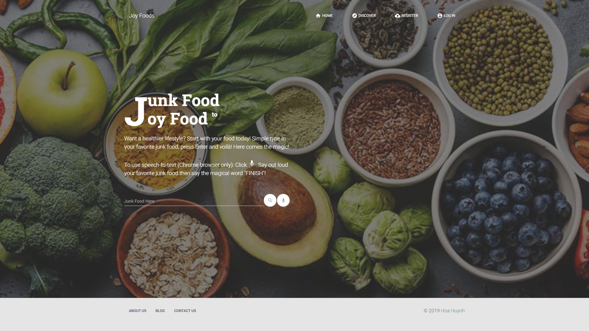

# CoderSchool FTW - * Junk Food to Joy Food *

Created with love by: Huynh Te Hoa
  
My first complete full-stack web project, which was built with ReactJS for front-end and Python-Flask for back-end. This website is also the winner of CoderSchool Demo Day for Yosimite Class.

## View online at: https://joyfood.netlify.com

## Full demo at: https://www.youtube.com/watch?v=5BYSLIqVi-4&feature=youtu.be

## User Stories

* [x] Users can convert junk food into joy food through searchbar
* [x] Chrome users can use Speech-to-Text and finish with the keyword "Finish" to perform the search
* [x] Users can contact admin through form
* [x] Users can create accounts
* [x] Users can login using created accounts or Facebook
* [x] Each user has a specific colored avatar (inspired by Google's avatars)
* [x] Users can reset password through email
* [x] Users can change their current passwords
* [x] Users can see all current joy food recipes through "Discover" tab
* [x] Users can searchh within all recipes
* [x] Users can check for author, created date and time, ingredients, methods, nutritional facts, etc.
* [x] Users can check where to buy specific food items
* [x] Users can access restaurants address through Google Map
* [x] Users can add recipes to their favorite lists
* [x] Users can remove recipes from their favorite lists
* [x] Users can view their favorite recipes in their favorite lists
* [x] Users can create their custom recipes with pictures
* [x] Users can edit their recipes
* [x] Users can delete their recipes
* [x] Admin users can edit and delete others' recipes
* [x] Admin users can add restaurants to specific food items
* [x] Users will encounter a "404 Not Found" page upon invalid URL

## Time Spent and Lessons Learned

Time spent: **2 weeks** spent in total.

Describe any challenges encountered while building the app.

## License

    Copyright [2019] [Huynh Te Hoa]

    Licensed under the Apache License, Version 2.0 (the "License");
    you may not use this file except in compliance with the License.
    You may obtain a copy of the License at

        http://www.apache.org/licenses/LICENSE-2.0

    Unless required by applicable law or agreed to in writing, software
    distributed under the License is distributed on an "AS IS" BASIS,
    WITHOUT WARRANTIES OR CONDITIONS OF ANY KIND, either express or implied.
    See the License for the specific language governing permissions and
    limitations under the License.
